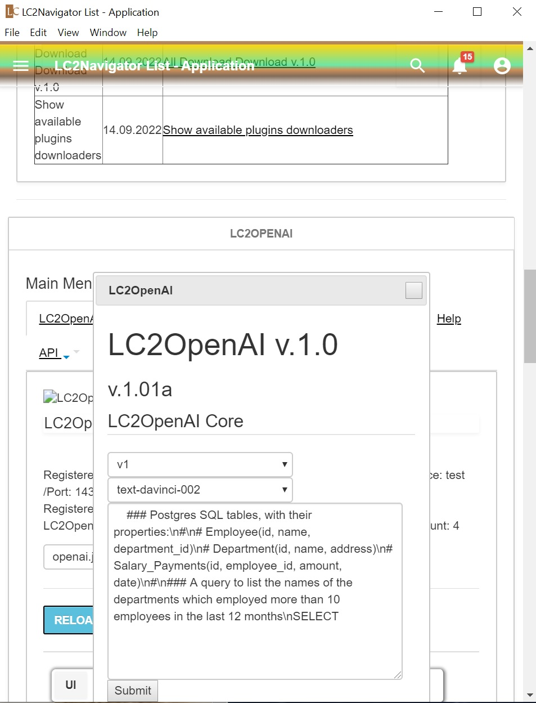
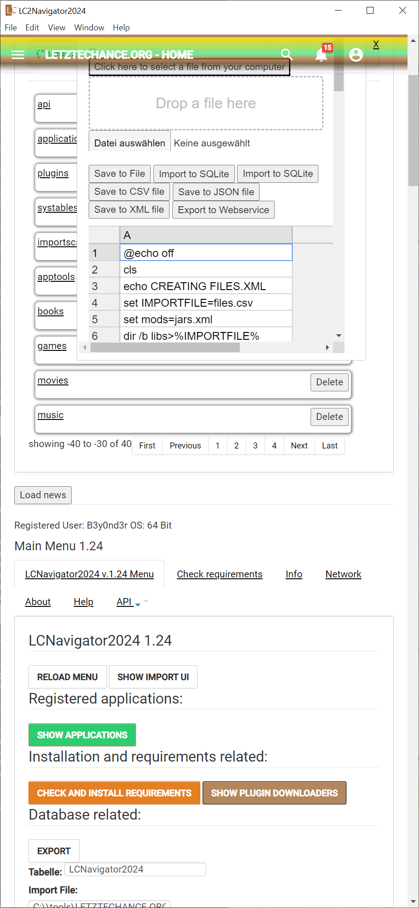
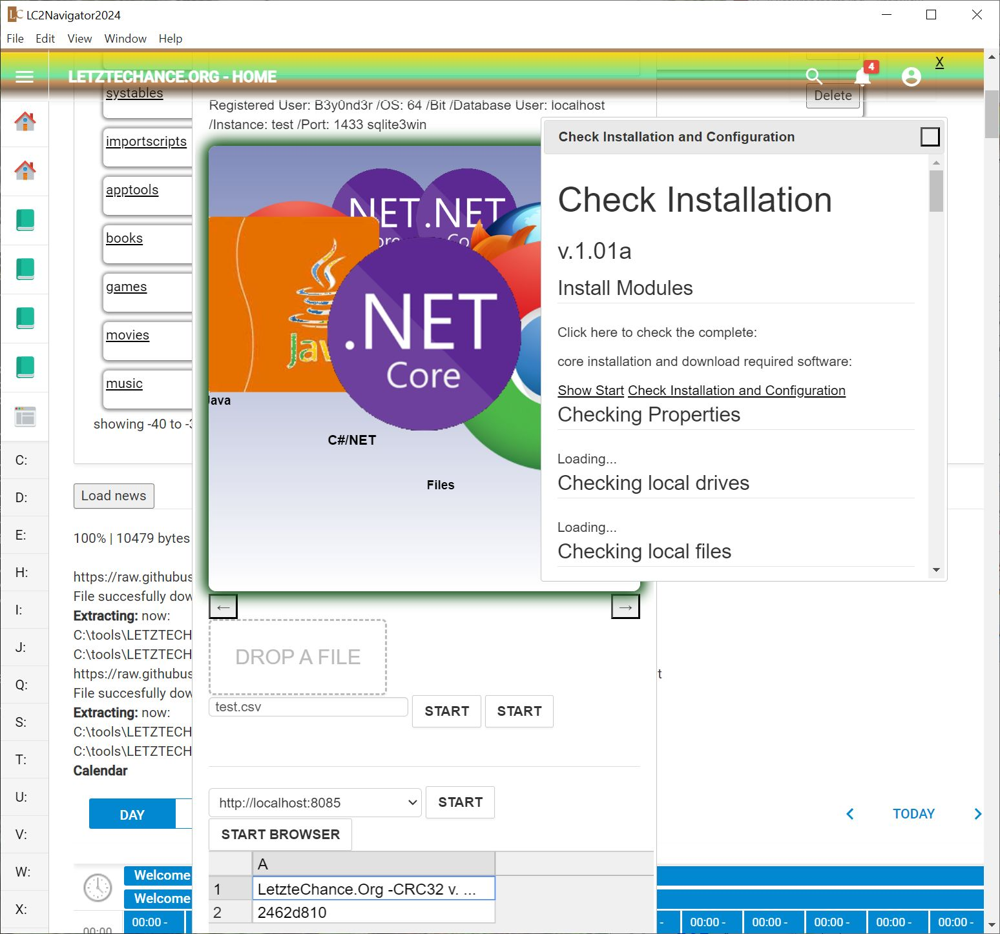

<h1>LC2Navigator2024</h1>

### LC2Navigator screenshot:

## What is "LC2Navigator" app?

It is a UI Database redirecting IO, News, Links, Grabbing, Container Orchistration, Building OS Software
and local AI system 
based on Electron, Apache Cordova, NodeJS Javascript SQLite and Maven.

Different technologies used and supported java, rust, python and many more.
Uses and supports Maven 3.9x, Gradle, NSIS, WI...

A windows and linux x64 Bit build artifact created and uploaded. 
Microsoft Windows Installer build and uploaded. 
- 32 Bit is not longer supported.

There are different "Plugins" with a different technology stack.

Please notice:Java have to be installed.

### OpenAI Plugin screenshot:

### Excel Transformation Plugin screenshot:

### Checking all requirements Plugin screenshot:

## Source:
- https://letztechance.org
- <a href="https://www.letztechance.org/">LetzteChance.Org</a>
- <a href="https://www.letztechance.org/vue/">LC powered by vue)</a>
- <a href="https://www.letztechance.org/dist/">LC powered by angular)</a>

## Windows 64 Bit Installer:

- <a href="https://raw.githubusercontent.com/David-Honisch/LC2Navigator2024/main/LC2Navigator2024/LC2Navigator2024install.exe" target="_blank">LC2Navigator2024 x64 install.exe</a>
- https://raw.githubusercontent.com/David-Honisch/LC2Navigator2024/main/LC2Navigator2024/LC2Navigator2024install.exe

Permanent Link:
https://www.letztechance.org/read-20-35.html

## Linux 64 Bit Installer:
(coming soon)
https://www.letztechance.org/read-20-40.html

## Developmet

# LC2Navigator2025 (Alpha 1) Updates

This is the current development release:
Entering:Alpha 1 Status

Please try the new UI:
- https://github.com/David-Honisch/LC2Navigator2024/tree/main/LC2Navigator2025

Windows release:
- https://github.com/David-Honisch/LC2Navigator2024/tree/main/LC2Navigator2025 (x64 windows win11 tested)
Linux release:(build coming soon...)
- https://github.com/David-Honisch/LC2Navigator2024/tree/main/LC2Navigator2025 (build coming soon...)
Linux release:(build coming soon...)
- https://github.com/David-Honisch/LC2Navigator2024/tree/main/LC2Navigator2025 (build coming soon...)

## HomePage - Permanent Link:LC2Navigator2024install.exe (Microsoft Windows x64):

- https://www.letztechance.org/read-20-35.html

## Logo:

## Plugins

All plugin downloads managed via this file:
https://raw.githubusercontent.com/David-Honisch/LC2Navigator2024/main/LC2Navigator2024/all.zip

or use the automatic installation inside of lc2navigator.

# Notice:Deprecated or unsupported Plugins

- SQLIte and NPM AutoInstall Packages 
	- Required. Please always update this package
- Core 
	- SQLITE Import, Export, CRUD and more...
- LC2Process 
	- Show and kill system processes
- LC2Redirect 
	- Redirect Output
- LC2Zip 
	- .NET Core
- LC2Zip 
	- ZIP Java Java Installer (SWT)
- LC2UnZip 
	- Unzip .NET Core
- LC2UnZip 
	- LC2UnZip Java Java Installer (SWT)
- LC2DL 
	- LetzteChance.Org offizieller Downloader
- LC2Start.NET 
	- LetzteChance.Org offizieller Windows .NET 4.72 Installer
- LC2SQLIITEGUI 
	- LetzteChance.Org offizieller LC2SQLIITEGUI
- LC2RESTIFY 
	- LC2RESTIFY
- LC2SOAP 
	- LC2SOAP
- LC2ExcelTransform 
	- Up to now there is Supports xls|xlsx|xlsm|xlsb|xml|csv|txt|dif|sylk|slk|prn|ods|fods|htm|html based Editor and Converter
- LC2SAPUI
	- - SAP.UI Electron Webpack Project (Routing JSON and query based fragments and models)
- LC2Docker 
	- Some fist scripts (updates coming soon.
- LC2FTP 
	- FTP Client based on HMTL/NodeJS
- LC2EXPRESS 
	- HTTP NPM HTTPSERVER
- LC2UnityServer 
	- LC2UnityServer
- LC2UnityServerClient 
	- LC2UnityServerClient Chromium Client 
- LC2Color 
	- .NET v.4.7.2
- LC2Color 
	- .NET Core v.3.1
- LC2Python 
	- LC2Python (Python 3 Scripts)
- LC2PHP 
	- LC2PHP (PHP Installation required)
- LC2FFMPEG 
	- LC2FFMPEG
- LC2PAINT 
- LC2PAINT - Simple 3D Painter with small animations
- LC2MySQLDocker 
	- LC2MySQLDocker - Docker MySQL Server to host tcp port 3306
- LC2PostGresSQL 
	- LC2MySQLDocker - Docker Postgres Server to host tcp port
- LC2SQLServer 
	- LC2SQLServer - Docker MySQL to host tcp port	
- LC2RotatingTorproxy 
	- LC2RotatingTorproxy - Docker LC2RotatingTorproxy ha proxy with rotating tor proxy list nodes
- LC2Python
	- LC2Python - Docker LC2Python some python scripts
- LC2Kafka down!		
- LC2Hadoop down!		
- LC2OpenSSH down!	
- LC2WatsonX down!	

- see https://www.letztechance.org to get more information.
	
	
 
LC2Navigator supports Excel and XML/XSLT Transformation processing:
- file extension supports 
	- Up to now there is Supports xls|xlsx|xlsm|xlsb|xml|csv|txt|dif|sylk|slk|prn|ods|fods|htm|html based Editor and Converter

##Basic Requirements

Windows 64
Mac IOS (plugins not supported)
Linux (plugins not supported)

### Note:
- Curently only windows x64 builds available. 
- 32 Bit Electron build is not longer supported

## Plugin Software Requirements (no autoinstall !!)

Python 3
Open JDK 8<

Note:Please install this third party software.

## Plugin requirements
- JDK 8<
- Docker Desktop
- Python 3x
- PHP 7.x
- CURL
- Maven
- Ant
- MsBuild
- ...

It may be vary.
Please, read the notes of the plugin or any development comments.

## Supported os

## Download

- Free ?? yes
- No ads ?? yes

Find your download: [https://github.com/David-Honisch/Microsoft-Windows/tree/master/LC2Navigator2024](https://github.com/David-Honisch/Microsoft-Windows/tree/master/LC2Navigator2024)

## Change log

##### 1.1.0
Allow fetch and download a single video

##### 1.0.0
Fetch videos from youtube playlist and download them one by one or all.

## Disclaimer

1. Please use this app for downloading only public resources.
2. The app doesn't store ANY media files ANYWHERE except on the device who use this app.

## License

- read download license	
- mostly open source resources
- read comments

## Development Notes

You can find scripts on this repository to solve following package.json entries:
	npm run startdev
    npm run tlint
	npm run webpack	
    npm run electron
	npm run test
	npm run release
	npm run build
	npm run buildwindows
	npm run buildmacos
	npm run buildlinux

### Stack

- [electron](http://electronjs.org/)
- [jquery](https://jquery.org/)
- [sqlite](https://sqlite.org/)
- [java](https://java.org/)
- [spring boot](https://spring.io/)
- [typescript](https://www.typescriptlang.org/)
- [webpack](https://webpack.js.org/)

#### Tests

- TODO
more plugins coming soon.. P-)

based on:
[emed java directly](https://github.com/jreznot/electron-java-app)
[jest](https://jestjs.io/)

## License
MIT
(c)by webmaster@letztechance.org
--------------------------
http://www.letztechance.org
Haftung f�r Inhalte 

Die Inhalte unserer Seiten wurden mit gr��ter Sorgfalt erstellt. F�r die Richtigkeit, Vollst�ndigkeit und 
Aktualit�t der Inhalte k�nnen wir jedoch keine Gew�hr �bernehmen. Als Diensteanbieter sind wir gem�� 
� 7 Abs.1 TMG f�r eigene Inhalte auf diesen Seiten nach den allgemeinen Gesetzen verantwortlich. 
Nach �� 8 bis 10 TMG sind wir als Diensteanbieter jedoch nicht verpflichtet, �bermittelte oder gespeicherte 
fremde Informationen zu �berwachen oder nach Umst�nden zu forschen, die auf eine rechtswidrige 
T�tigkeit hinweisen. 
Verpflichtungen zur Entfernung oder Sperrung der Nutzung von Informationen nach den allgemeinen 
Gesetzen bleiben hiervon unber�hrt. Eine diesbez�gliche Haftung ist jedoch erst ab dem Zeitpunkt 
der Kenntnis einer konkreten Rechtsverletzung m�glich. Bei Bekanntwerden von entsprechenden 
Rechtsverletzungen werden wir diese Inhalte umgehend entfernen. 

Haftung f�r Links 

Unser Angebot enth�lt Links zu externen Webseiten Dritter, auf deren Inhalte wir keinen Einfluss haben. 
Deshalb k�nnen wir f�r diese fremden Inhalte auch keine Gew�hr �bernehmen. F�r die Inhalte der 
verlinkten Seiten ist stets der jeweilige Anbieter oder Betreiber der Seiten verantwortlich. 
Die verlinkten Seiten wurden zum Zeitpunkt der Verlinkung auf m�gliche Rechtsverst��e �berpr�ft. 
Rechtswidrige Inhalte waren zum Zeitpunkt der Verlinkung nicht erkennbar. 
Eine permanente inhaltliche Kontrolle der verlinkten Seiten ist jedoch ohne konkrete Anhaltspunkte einer 
Rechtsverletzung nicht zumutbar. Bei Bekanntwerden von Rechtsverletzungen werden wir derartige Links 
umgehend entfernen. 

Urheberrecht 

Die durch die Seitenbetreiber erstellten Inhalte und Werke auf diesen Seiten unterliegen dem 
deutschen Urheberrecht. 
Die Vervielf�ltigung, Bearbeitung, Verbreitung und jede Art der Verwertung au�erhalb der Grenzen 
des Urheberrechtes bed�rfen der schriftlichen Zustimmung des jeweiligen Autors bzw. Erstellers. 
Downloads und Kopien dieser Seite sind nur f�r den privaten, nicht kommerziellen Gebrauch gestattet. 
Soweit die Inhalte auf dieser Seite nicht vom Betreiber erstellt wurden, werden die Urheberrechte Dritter 
beachtet. Insbesondere werden Inhalte Dritter als solche gekennzeichnet. Sollten Sie trotzdem auf eine 
Urheberrechtsverletzung aufmerksam werden, bitten wir um einen entsprechenden Hinweis. 
Bei Bekanntwerden von Rechtsverletzungen werden wir derartige Inhalte umgehend entfernen. 

Datenschutz 

Die Nutzung unserer Webseite ist in der Regel ohne Angabe personenbezogener Daten m�glich. 
Soweit auf unseren Seiten personenbezogene Daten (beispielsweise Name, Anschrift oder eMail-Adressen) 
erhoben werden, erfolgt dies, soweit m�glich, stets auf freiwilliger Basis. Diese Daten werden ohne Ihre 
ausdr�ckliche Zustimmung nicht an Dritte weitergegeben. 

Wir weisen darauf hin, dass die Daten�bertragung im Internet (z.B. bei der Kommunikation per E-Mail) 
Sicherheitsl�cken aufweisen kann. Ein l�ckenloser Schutz der Daten vor dem Zugriff durch Dritte ist nicht m�glich. 

Der Nutzung von im Rahmen der Impressumspflicht ver�ffentlichten Kontaktdaten durch Dritte zur �bersendung von 
nicht ausdr�cklich angeforderter Werbung und Informationsmaterialien wird hiermit ausdr�cklich widersprochen. 
Die Betreiber der Seiten behalten sich ausdr�cklich rechtliche Schritte im Falle der unverlangten Zusendung 
von Werbeinformationen, etwa durch Spam-Mails, vor. 

Datenschutzerkl�rung f�r die Nutzung von Facebook-Plugins (Like-Button) 

Auf unseren Seiten sind Plugins des sozialen Netzwerks 
Facebook, 1601 South California Avenue, Palo Alto, CA 94304, USA integriert. 
Die Facebook-Plugins erkennen Sie an dem Facebook-Logo oder dem "Like-Button" ("Gef�llt mir") auf unserer Seite. 
Eine �bersicht �ber die Facebook-Plugins finden Sie hier: http://developers.facebook.com/docs/plugins/. 
Wenn Sie unsere Seiten besuchen, wird �ber das Plugin eine direkte Verbindung zwischen Ihrem Browser und 
dem Facebook-Server hergestellt. Facebook erh�lt dadurch die Information, dass Sie mit Ihrer IP-Adresse unsere Seite 
besucht haben. Wenn Sie den Facebook "Like-Button" anklicken w�hrend Sie in Ihrem Facebook-Account eingeloggt sind, 
k�nnen Sie die Inhalte unserer Seiten auf Ihrem Facebook-Profil verlinken. 
Dadurch kann Facebook den Besuch unserer Seiten Ihrem Benutzerkonto zuordnen. Wir weisen darauf hin, dass wir 
als Anbieter der Seiten keine Kenntnis vom Inhalt der �bermittelten Daten sowie deren Nutzung durch Facebook erhalten. 
Weitere Informationen hierzu finden Sie in der Datenschutzerkl�rung von facebook unter http://de-de.facebook.com/policy.php 

Wenn Sie nicht w�nschen, dass Facebook den Besuch unserer Seiten Ihrem Facebook-Nutzerkonto zuordnen kann, 
loggen Sie sich bitte aus Ihrem Facebook-Benutzerkonto aus. 

Datenschutzerkl�rung f�r die Nutzung von Google Analytics 

Diese Website benutzt Google Analytics, einen Webanalysedienst der Google Inc. ("Google"). 
Google Analytics verwendet sog. "Cookies", Textdateien, die auf Ihrem Computer gespeichert werden und die eine Analyse 
der Benutzung der Website durch Sie erm�glichen. 
Die durch den Cookie erzeugten Informationen �ber Ihre Benutzung dieser Website werden in der Regel an einen Server von 
Google in den USA �bertragen und dort gespeichert. Im Falle der Aktivierung der IP-Anonymisierung auf dieser Webseite wird 
Ihre IP-Adresse von Google jedoch innerhalb von Mitgliedstaaten der Europ�ischen Union oder in anderen Vertragsstaaten 
des Abkommens �ber den Europ�ischen Wirtschaftsraum zuvor gek�rzt. 

Nur in Ausnahmef�llen wird die volle IP-Adresse an einen Server von Google in den USA �bertragen und dort gek�rzt. 
Im Auftrag des Betreibers dieser Website wird Google diese Informationen benutzen, um Ihre Nutzung der Website auszuwerten, 
um Reports �ber die Websiteaktivit�ten zusammenzustellen und um weitere mit der Websitenutzung und der Internetnutzung 
verbundene Dienstleistungen gegen�ber dem Websitebetreiber zu erbringen. Die im Rahmen von Google Analytics 
von Ihrem Browser �bermittelte IP-Adresse wird nicht mit anderen Daten von Google zusammengef�hrt. 

Sie k�nnen die Speicherung der Cookies durch eine entsprechende Einstellung Ihrer Browser-Software verhindern; 
wir weisen Sie jedoch darauf hin, dass Sie in diesem Fall gegebenenfalls nicht s�mtliche Funktionen dieser Website vollumf�nglich 
werden nutzen k�nnen. Sie k�nnen dar�ber hinaus die Erfassung der durch das Cookie erzeugten und auf Ihre Nutzung der Website 
bezogenen Daten (inkl. Ihrer IP-Adresse) an Google sowie die Verarbeitung dieser Daten durch Google verhindern, indem sie 
das unter dem folgenden Link verf�gbare Browser-Plugin herunterladen und installieren: 
http://tools.google.com/dlpage/gaoptout?hl=de. 

Datenschutzerkl�rung f�r die Nutzung von Google Adsense 

Diese Website benutzt Google AdSense, einen Dienst zum Einbinden von Werbeanzeigen der Google Inc. ("Google"). 
Google AdSense verwendet sog. "Cookies", Textdateien, die auf Ihrem Computer gespeichert werden und die eine Analyse der Benutzung 
der Website erm�glicht. Google AdSense verwendet auch so genannte Web Beacons (unsichtbare Grafiken). Durch diese Web Beacons 
k�nnen Informationen wie der Besucherverkehr auf diesen Seiten ausgewertet werden. 

Die durch Cookies und Web Beacons erzeugten Informationen �ber die Benutzung dieser Website (einschlie�lich Ihrer IP-Adresse) und 
Auslieferung von Werbeformaten werden an einen Server von Google in den USA �bertragen und dort gespeichert. Diese Informationen 
k�nnen von Google an Vertragspartner von Google weiter gegeben werden. Google wird Ihre IP-Adresse jedoch nicht mit anderen von 
Ihnen gespeicherten Daten zusammenf�hren. 

Sie k�nnen die Installation der Cookies durch eine entsprechende Einstellung Ihrer Browser Software verhindern; wir weisen Sie jedoch 
darauf hin, dass Sie in diesem Fall gegebenenfalls nicht s�mtliche Funktionen dieser Website voll umf�nglich nutzen k�nnen. 
Durch die Nutzung dieser Website erkl�ren Sie sich mit der Bearbeitung der �ber Sie erhobenen 
Daten durch Google in der zuvor beschriebenen Art und Weise und zu dem zuvor benannten Zweck einverstanden. 

Datenschutzerkl�rung f�r die Nutzung von Google 1 

Erfassung und Weitergabe von Informationen: 
Mithilfe der Google 1-Schaltfl�che k�nnen Sie Informationen weltweit ver�ffentlichen. �ber die Google 1-Schaltfl�che 
erhalten Sie und andere Nutzer personalisierte Inhalte von Google und unseren Partnern. Google speichert sowohl die 
Information, dass Sie f�r einen Inhalt 1 gegeben haben, als auch Informationen �ber die Seite, die Sie beim Klicken 
auf 1 angesehen haben. Ihre 1 k�nnen als Hinweise zusammen mit Ihrem Profilnamen und Ihrem Foto in 
Google-Diensten, wie etwa in Suchergebnissen oder in Ihrem Google-Profil, oder an anderen Stellen 
auf Websites und Anzeigen im Internet eingeblendet werden. 
Google zeichnet Informationen �ber Ihre 1-Aktivit�ten auf, um die Google-Dienste f�r Sie und andere zu verbessern. 
Um die Google 1-Schaltfl�che verwenden zu k�nnen, ben�tigen Sie ein weltweit sichtbares, 
�ffentliches Google-Profil, das zumindest den f�r das Profil gew�hlten Namen enthalten muss. 
Dieser Name wird in allen Google-Diensten verwendet. In manchen F�llen kann dieser Name auch einen 
anderen Namen ersetzen, den Sie beim Teilen von Inhalten �ber Ihr Google-Konto verwendet haben. 
Die Identit�t Ihres Google-Profils kann Nutzern angezeigt werden, die Ihre E-Mail-Adresse kennen oder 
�ber andere identifizierende Informationen von Ihnen verf�gen. 

Verwendung der erfassten Informationen: 
Neben den oben erl�uterten Verwendungszwecken werden die von Ihnen bereitgestellten Informationen 
gem�� den geltenden Google-Datenschutzbestimmungen genutzt. Google ver�ffentlicht m�glicherweise 
zusammengefasste Statistiken �ber die 1-Aktivit�ten der Nutzer bzw. gibt diese an Nutzer und Partner weiter, 
wie etwa Publisher, Inserenten oder verbundene Websites. 

Datenschutzerkl�rung f�r die Nutzung von Twitter 

Auf unseren Seiten sind Funktionen des Dienstes Twitter eingebunden. Diese Funktionen werden 
angeboten durch die Twitter Inc., 795 Folsom St., Suite 600, San Francisco, CA 94107, USA. 
Durch das Benutzen von Twitter und der Funktion "Re-Tweet" werden die von Ihnen besuchten Webseiten 
mit Ihrem Twitter-Account verkn�pft und anderen Nutzern bekannt gegeben. Dabei werden auch Daten an Twitter �bertragen. 

Wir weisen darauf hin, dass wir als Anbieter der Seiten keine Kenntnis vom Inhalt der �bermittelten Daten sowie deren Nutzung 
durch Twitter erhalten. Weitere Informationen hierzu finden Sie in der Datenschutzerkl�rung von Twitter unter http://twitter.com/privacy. 

Ihre Datenschutzeinstellungen bei Twitter k�nnen Sie in den Konto-Einstellungen unter http://twitter.com/account/settings �ndern. 

Quellenangaben: eRecht24 Disclaimer, Facebook Datenschutzerkl�rung, Google Analytics Bedingungen, 
Datenschutzerkl�rung f�r Google Adsense, Datenschutzerkl�rung Google 1, Datenschutzerkl�rung f�r Twitter 

Kontakt: 

https://www.letztechance.org/contact.html